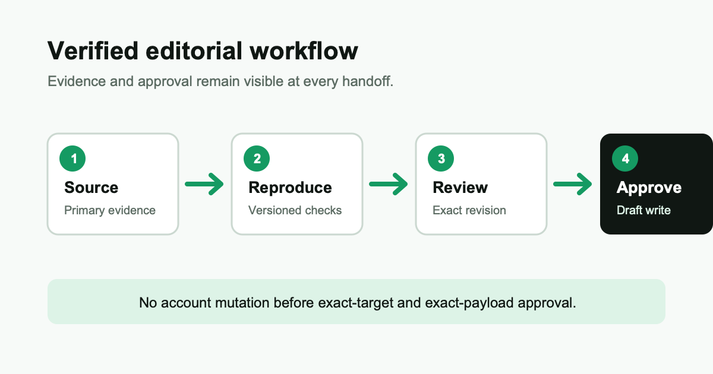

## 01. Build one verified workflow

This example shows **portable formatting**, a [primary source](https://example.com/docs), and `inline code`.

> Verify the version and permissions before running an agent.

### Setup

1. Create an isolated fixture.
2. Run the smallest approved command.
3. Inspect the diff and tests.

```bash
example-agent --version
example-agent run --approval scoped
```

### What to record

- Starting commit
- Model and version
- Tool approvals
- Test result



▲ The verified workflow keeps evidence separate from generated explanation.

---

The final article should explain limitations and the next safe experiment.
