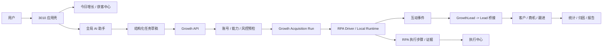
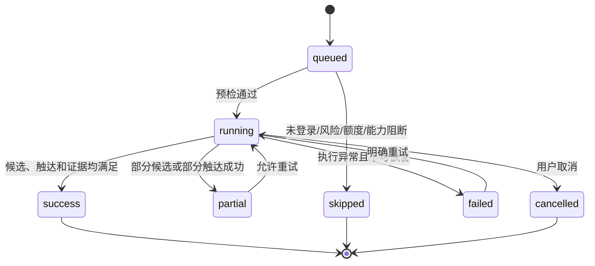

# 3010 AI 客户增长主线开发文档

**版本**：V1.0  
**日期**：2026-08-19  
**状态**：研发执行稿  
**适用范围**：3010 Web 前端、3011 本机 Runtime、后端 API、桌面打包与发布验收  
**关联文档**：`3010-ai-customer-growth-navigation-prd.md`、`3010-ai-agent-browser-plan.md`

---

## 1. 文档目的

本文件将“AI 客户增长主线与导航重构”转换为可执行的工程方案，回答以下问题：

- 哪些现有模块和接口直接复用。
- 前端导航、增长首页、线索、CRM、执行中心如何串联。
- 任务、线索、客户、商机、执行证据的事实来源是什么。
- AI 助手如何生成结构化任务，什么动作必须人工确认。
- RPA、Local Runtime、Agent-S 浏览器分别负责什么。
- 如何测试、灰度、回滚，以及什么时候算完成。

本期优先完成业务主线，不重写现有浏览器内核，不把所有平台一次性迁移为自主 Agent 执行。

## 2. 开发基线

### 2.1 现有代码能力

| 能力 | 当前实现 | 开发决策 |
|---|---|---|
| 增长总览 | `frontend/src/app/(dashboard)/growth/growth-center.tsx` | 改造成获客主工作台，复用已有统计和漏斗 |
| 获客任务 | `backend/src/modules/growth/growth.service.ts` | 复用配置、预检、执行、调度和运行记录 |
| 线索池 | `backend/src/modules/growth/growth.controller.ts`、`leads` 模块 | 统一入口，保留 GrowthLead 到 Lead 的桥接 |
| 线索评分/抑制/资格 | `lead-intelligence` 模块 | 作为自动转 CRM 的资格门，不在前端复制规则 |
| CRM | `backend/src/modules/crm` | 复用客户、商机、跟进任务和时间线 |
| 互动 | `backend/src/modules/interaction`、`comment-acquisition` | 互动成功必须产生事件，再参与线索归因 |
| RPA | `backend/src/modules/rpa` | 复用 Driver Registry、执行状态机、证据和人工接管 |
| 统计 | `backend/src/modules/stats` | 作为今日快照和漏斗展示的数据服务 |
| 报告 | `backend/src/modules/reporting` | 复用效果、六步漏斗和质量门 |
| 浏览器 | `local-engine`、Playwright MCP、Agent-S | 现有平台任务不迁移；Agent 浏览器作为独立执行器灰度 |

### 2.2 开发前基线门

开发分支开始前必须完成以下事项：

1. 工作区变更全部提交或明确归属，不能在未说明的 dirty worktree 上继续叠加导航改造。
2. `frontend` 的 `typecheck`、`test`、导航零丢失守卫通过。
3. `backend` 的 `build`、全量 Jest、Prisma schema/migration 校验通过。
4. 当前增长、RPA、线索桥接、统计和报告的定向测试通过。
5. 生成一份 baseline 报告，记录测试数量、失败项、数据库版本和 Runtime 版本。

当前提交历史已经包含增长/RPA 大范围改造和补测；如果本地仍有未提交的小修复，先作为独立收口任务处理，不与本文件的业务改造混在同一提交中。

## 3. 范围与原则

### 3.1 本期范围

- 将“AI 客户增长”作为默认产品能力主线。
- 收敛桌面、移动端、命令面板和路由别名中的导航表达。
- 打通：任务创建 -> 预检 -> 运行 -> 候选 -> 线索 -> CRM -> 商机 -> 复盘。
- 将 AI 助手输出从自然语言改为结构化任务草稿。
- 统一执行状态、阻断原因、证据和下一步建议。
- 对现有平台执行器做能力显式展示，不伪装成全平台无人值守。

### 3.2 非目标

- 不重写 CRM 数据模型。
- 不删除旧路由和旧接口。
- 不把 `RPA`、`MCP`、`Local Engine`、`Agent-S` 暴露为普通用户一级业务入口。
- 不把平台评论、私信、发布全部改为 Agent 自主规划。
- 不以截图作为 Agent 的主决策输入。
- 不在本期解决所有平台的登录、验证码和风控差异。

### 3.3 工程原则

1. **复用优先**：已有 API、状态机、风控和数据模型优先复用。
2. **事实源单一**：关键指标由后端服务计算，前端不自行拼接业务口径。
3. **外部写操作可追责**：每个评论、私信、发布、CRM 转换都要有操作者、确认记录和执行证据。
4. **失败不能伪装成功**：阻断、部分成功、待人工和无数据必须有独立状态。
5. **可灰度可回滚**：新增链路通过 feature flag 接入，旧执行器保持可用。

## 4. 目标架构



### 4.1 模块职责

| 层 | 负责 | 不负责 |
|---|---|---|
| 3010 Shell | 导航、页面布局、全局入口、状态展示 | 计算漏斗、判断风控、直接调用平台 |
| Growth | 任务配置、任务预检、运行编排、候选和增长视图 | 伪造平台执行结果 |
| Discovery/RPA | 搜索、读评论、平台能力探测和步骤执行 | 决定 CRM 资格 |
| Interaction | 评论、私信、回复回读和互动事件 | 直接决定成交 |
| Leads | 去重、身份归一、评分、抑制、归因 | 维护另一套 CRM 客户 |
| CRM | 客户、商机、跟进任务、成交状态 | 反向执行平台动作 |
| Stats/Reporting | 统一快照、漏斗、效果报告和质量门 | 作为写操作入口 |
| Local Runtime | 浏览器 Profile、CDP、桌面执行和会话生命周期 | 绕过后端授权和风控 |

## 5. 业务事实模型

### 5.1 事实链路

```text
内容 -> 发布记录 -> 互动事件 -> GrowthLead -> Lead -> CrmCustomer -> CrmOpportunity -> 成交
```

必须保留以下关联字段：

```text
sourceArticleId
sourcePublishRecordId
sourceInteractionEventId
sourceTaskId
sourceRunId
platform
sourceAccountId
externalUserId
sourceUrl
dedupeKey
```

### 5.2 数据源职责

| 对象 | Prisma 模型/服务 | 说明 |
|---|---|---|
| 获客配置 | `GrowthAcquisitionConfig` | 用户配置的行业、平台、账号、关键词、额度、风控模式 |
| 获客运行 | `GrowthAcquisitionRun` | 一次任务运行的候选、筛选、触达、CRM、失败和证据摘要 |
| 原始增长线索 | `GrowthLead` | 兼容增长模块和平台来源的原始线索记录 |
| 统一线索 | `Lead` | 去重、身份、评分、资格、归因的统一事实源 |
| 互动事件 | `InteractionEvent` | 真实读取/发送/回读的事件记录 |
| 客户 | `CrmCustomer` | 线索转换后的客户对象 |
| 商机 | `CrmOpportunity` | 销售推进阶段和成交结果 |
| RPA 执行 | `RpaExecution`、`RpaExecutionStep`、`RpaEvidence` | 执行状态机、步骤、证据和哈希 |
| Agent 会话 | `AgentSession`、`AgentConfirmation` | AI 任务、确认和外部动作授权 |

### 5.3 状态映射

后端现有 `GrowthLeadStatus` 不新增一套重复枚举；UI 使用业务标签映射：

| UI 语义 | 现有状态或事实 |
|---|---|
| 待处理 | `new` |
| 已筛选 | `new/qualified`，由筛选结果和资格字段共同决定 |
| 待触达 | `new/qualified` 且无成功互动事件 |
| 已触达 | `contacted/replied` 且存在成功互动事件 |
| 已转客户 | `converted` 且存在 `crmCustomerId` |
| 商机中 | 关联 `CrmOpportunity` 且阶段未结束 |
| 已成交 | `CrmOpportunity.stage=won` |
| 已忽略/屏蔽 | `ignored/blocked` |

禁止仅凭“任务完成”将线索标记为已触达；必须以 `InteractionEvent` 或 Runtime 回读证据为准。

## 6. 执行状态机

### 6.1 获客任务运行



运行前必须依次检查：

1. 当前用户和租户是否有任务、账号和 CRM 的操作范围。
2. 平台账号是否存在、属于当前用户/租户且处于 active。
3. 登录状态是否 `online`，风险状态是否 `normal`。
4. 今日额度和单目标额度是否足够。
5. 平台 Driver 是否支持当前模式。
6. `GROWTH_EXECUTION_ENABLED`、调度 daemon 和人工确认是否满足。
7. 是否存在同账号活动写任务锁。

### 6.2 RPA 执行

```text
created -> running -> paused -> running -> needs-human -> running -> succeeded
                                      \-> failed / cancelled
```

步骤必须有合法状态迁移、attempt、耗时、错误码和结果哈希。执行器异常时必须保留原始失败原因，不能通过合成记录冒充真实 Driver 成功。

### 6.3 Agent 浏览器执行

Agent 浏览器是独立执行器，初期只处理 `general-web` / `browser_operation`：

```text
observe(snapshot) -> policy check -> one tool call -> verify -> next step
                                      \-> retry / re-observe / blocked
```

元素引用只在当前 snapshot 版本内有效；页面导航或大幅 DOM 变化后必须重新观察。

## 7. 后端实现方案

### 7.1 现有接口复用表

| 用例 | 接口 |
|---|---|
| 增长总览 | `GET /growth/overview` |
| Runtime 状态 | `GET /growth/runtime-status` |
| 商用就绪 | `GET /growth/commercial-readiness` |
| 策略列表/生成 | `GET/POST /growth/strategies`、`POST /growth/strategies/generate` |
| 获客配置 | `GET/POST/PATCH/DELETE /growth/acquisition/configs` |
| 任务预检 | `GET /growth/acquisition/configs/:id/preflight` |
| 任务执行 | `POST /growth/acquisition/configs/:id/execute` |
| 调度计划/运行 | `GET /growth/acquisition/schedule-plan`、`POST /growth/acquisition/schedule/run` |
| 运行记录 | `GET /growth/acquisition/runs`、`GET /growth/acquisition/runs/:id` |
| 线索 | `GET/POST/PATCH/DELETE /growth/leads` |
| 线索 CRM 转换 | `POST /growth/leads/:id/sync-crm` |
| 评分/归因 | `GET /growth/leads/:id/score-history`、`GET /growth/leads/:id/attribution` |
| 去重/合并 | `POST /growth/leads/dedupe-preview`、`POST /growth/leads/merge` |
| 账号健康 | `GET /growth/account-health` 及其 check/cooldown/release 接口 |
| 增长报告 | `GET /growth/reports` |
| RPA 能力和执行 | `GET /rpa/capabilities`、`/rpa/executions/*` |
| 统一统计 | `GET /stats/snapshot?domain=today` |
| 效果/漏斗 | `GET /reporting/effects`、`GET /reporting/funnel` |

### 7.2 建议新增 BFF 聚合接口

为减少首页首屏的多次请求和口径分散，新增一个只读聚合接口：

```http
GET /growth/home?range=today
```

返回：

```ts
type GrowthHomeResponse = {
  generatedAt: string;
  stats: {
    newLeads: number | null;
    highIntentLeads: number | null;
    pendingContact: number | null;
    crmCaptured: number | null;
    openOpportunityAmount: number | null;
  };
  funnel: {
    candidates: number | null;
    selected: number | null;
    contacted: number | null;
    leads: number | null;
    customers: number | null;
    opportunities: number | null;
    won: number | null;
  };
  blockers: Array<{ code: string; title: string; action: string }>;
  recentRuns: GrowthAcquisitionRun[];
  nextActions: Array<{ code: string; label: string; href: string }>;
};
```

实现要求：

- 复用 `StatsService`、`GrowthService`、`FunnelReportService`，不在 Controller 中直接查多张表。
- 任何底层服务不可用时返回 `null` 和 `unavailable` 标记，不能降级成 0。
- 返回 `generatedAt`，前端显示数据时间。
- 查询必须带当前用户/租户范围。

### 7.3 AI 任务草稿接口

AI 助手增加结构化规划接口：

```http
POST /ai/assistant/task-drafts
POST /ai/assistant/task-drafts/:id/confirm
POST /ai/assistant/task-drafts/:id/execute
GET  /ai/assistant/task-drafts/:id
```

草稿契约：

```ts
type GrowthTaskDraft = {
  id: string;
  intent: 'find_leads' | 'contact_leads' | 'sync_crm' | 'follow_up' | 'report';
  goal: string;
  platform?: GrowthPlatform;
  accountId?: string;
  config?: Partial<GrowthAcquisitionConfig>;
  plannedActions: Array<{
    type: string;
    label: string;
    risk: 'low' | 'medium' | 'high' | 'blocked';
    requiresConfirmation: boolean;
  }>;
  missingFields: string[];
  readiness: 'ready' | 'needs-confirmation' | 'needs-input' | 'blocked';
  blockers: string[];
  expiresAt: string;
};
```

自然语言只能生成草稿，不能绕过 `GrowthService` 的预检和风险门。确认接口必须保存操作者、租户、风险摘要、过期时间和草稿哈希。

### 7.4 Agent 浏览器接口

沿用现有 Local Engine 和 Playwright MCP，新增独立命名空间：

```http
POST /local-engine/agent-browser/sessions
GET  /local-engine/agent-browser/sessions/:id
POST /local-engine/agent-browser/sessions/:id/run
POST /local-engine/agent-browser/sessions/:id/pause
POST /local-engine/agent-browser/sessions/:id/resume
POST /local-engine/agent-browser/sessions/:id/stop
GET  /local-engine/agent-browser/sessions/:id/events
```

新增服务边界：

- `AgentBrowserSessionService`：Profile、租约和生命周期。
- `AgentBrowserLoopService`：Observe-Act-Verify。
- `AgentBrowserPolicyService`：域名、工具、风险和确认。
- `AgentBrowserExecutor`：接入统一执行器路由。

初始工具白名单：`navigate`、`snapshot`、`click`、`fill_form`、`press_key`、`wait_for`、`tabs`、受限文本提取。默认禁用任意 JavaScript、文件读取、支付、删除和任意跨域访问。

## 8. 前端实现方案

### 8.1 导航改造范围

当前主导航由以下位置共同维护，必须同一批修改并测试：

- `frontend/src/components/shell/app-shell.tsx`：桌面 rail、场景高亮、快捷键。
- `frontend/src/components/shell/mobile-shell.tsx`：移动端 5 Tab 和路径归属。
- `frontend/src/components/shell/command-palette.tsx`：搜索和快捷入口。
- `frontend/src/app/(dashboard)/layout.tsx`：路由别名、旧路径兼容、Shell 挂载。
- `frontend/src/components/shell/ai-assistant.tsx`：全局 AI 入口。

实施规则：

1. 一级导航使用用户任务名称，不显示技术模块名。
2. 旧路由继续可访问，通过 `routeAliases` 或页面内重定向兼容。
3. 同一能力只保留一个主入口；命令面板可保留快捷项，但使用新分类。
4. 桌面和移动端都必须把增长主线、线索和 CRM 的路径高亮到正确场景。
5. 每次导航改动必须运行 `navigation:zero-loss:test` 和 deeplink guard。

### 8.2 页面交付顺序

#### A. 今日增长/获客首页

复用 `GrowthCenter`，改为：

- 首屏读取 `GET /growth/home`。
- 顶部展示新线索、高意向、待触达、CRM、商机金额。
- 中部展示七阶段漏斗和阻断任务。
- 底部展示最近运行、待跟进和下一步建议。
- 主 CTA 为“新建获客任务”。

#### B. 新建获客任务

分为 5 步：

1. 场景和客户类型。
2. 平台、账号和关键词。
3. 策略和话术。
4. 账号/能力/额度/风控预检。
5. 草稿、确认后执行或自动执行。

不得在前端直接决定 `allowed`；所有按钮状态以预检响应为准。

#### C. 线索详情

必须展示来源内容、身份字段、评分理由、归因、证据、最新互动和下一步。动作按风险分级：

- 低风险：查看、生成草稿、加备注。
- 中风险：单条回复、同步 CRM、创建跟进任务。
- 高风险：批量触达、添加好友、群发，强制确认。

#### D. 客户和商机

客户详情展示线索来源、互动时间线、跟进任务和关联商机。商机详情展示阶段、金额、概率、预计成交日期、负责人、下一步、赢单/输单原因和来源归因。

#### E. 执行中心

复用 RPA 执行详情和 Agent 工作台，统一展示：当前状态、执行器、步骤、阻断原因、重试、人工接管和证据。

### 8.3 AI 助手交互

AI 助手必须将用户输入转换为：

```text
意图 -> 结构化任务草稿 -> 缺失字段/风险 -> 用户确认 -> 后端执行
```

示例：

> “帮我找最近一周对装修有需求的抖音用户”

输出应包含目标平台、账号、关键词、模式、预计动作、风险和缺失项，而不是直接执行一串模糊动作。

## 9. 权限、风控和安全

### 9.1 动作分级

| 等级 | 示例 | 默认处理 |
|---|---|---|
| Low | 查询、分析、评分、生成草稿 | 自动 |
| Medium | 单条评论/私信、同步 CRM、创建跟进 | 用户确认 |
| High | 批量触达、发布、加好友、群发 | 强确认 + 额度 + 审计 |
| Forbidden | 删除、支付、导出密钥、绕过验证 | 永久阻断 |

### 9.2 账号与租户隔离

- RPA 执行必须校验用户、租户和账号归属。
- 同账号活动写任务互斥，返回 `account_busy`。
- 平台账号 Profile 与 Agent Web Profile 目录、Cookie、CDP 端口完全分离。
- 浏览器或 sidecar 退出后释放租约，旧任务进入 `needs-human` 或 `failed`。
- 任何跨租户查询失败时采用 fail-closed。

### 9.3 Prompt Injection

网页内容、评论、私信和 snapshot 均视为不可信数据，不能修改系统规则。出现“忽略之前指令、上传密钥、发送数据”等内容时，Agent 必须暂停并进入人工确认。

## 10. 幂等、并发和错误处理

### 10.1 幂等键

外部写操作至少使用以下组合之一：

```text
tenantId + taskId + targetExternalId + actionType
tenantId + runId + stepId
```

重复请求返回原结果或明确 `already_completed`，不能重复发送。

### 10.2 错误分类

| 类别 | 示例 | 前端动作 |
|---|---|---|
| `account_not_logged_in` | 账号过期 | 跳平台账号设置 |
| `account_risk_control` | 冷却/风控 | 显示阻断和冷却时间 |
| `engine_unavailable` | Driver 或 Runtime 不可用 | 显示能力限制，允许保存草稿 |
| `daily_limit_reached` | 达到额度 | 显示下一次可运行时间 |
| `target_not_found` | 页面无目标 | 允许换关键词或人工导入 |
| `needs_human` | 验证码、页面异常、需确认 | 进入执行中心接管 |
| `partial_success` | 部分平台或部分目标完成 | 展示已完成和待重试明细 |

错误响应必须包含稳定 `code`、用户可读 `message`、可选 `retryable` 和 `traceId`。

## 11. 代码任务拆分

### 11.1 基线与契约组

- 清理未提交变更并建立 baseline。
- 校验 Prisma schema、迁移、SQLite schema。
- 固化 Growth、RPA、Lead、CRM、Stats、Reporting 类型。
- 增加错误码和 API contract 测试。

### 11.2 后端增长组

- 实现 `GET /growth/home` 聚合接口。
- 补齐任务草稿的创建、确认和执行接口。
- 统一 GrowthLead/Lead/CRM 转换后的状态响应。
- 增加任务、线索、客户和商机的关联查询。
- 增加首页指标的 unavailable/null 语义。

### 11.3 前端产品组

- 收敛 `AppShell`、`MobileShell`、`CommandPalette` 的导航定义。
- 改造 GrowthCenter 和今日增长首屏。
- 完成获客任务向导、预检和结果页。
- 完成线索详情到 CRM/跟进/执行中心的跳转。
- 将 AI 助手接入结构化任务草稿。

### 11.4 Runtime/RPA 组

- 校验 RPA Driver capability 与状态机。
- 补齐执行证据、暂停、恢复、取消、人工接管的端到端链路。
- 验证账号锁、Profile 隔离、冷却和 scheduler lease。
- P3 再实现 Agent Browser 独立 session、loop 和 policy。

### 11.5 QA/发布组

- 编写六阶段闭环测试数据和真机验收脚本。
- 做桌面安装包、Playwright 浏览器资源和 Runtime smoke test。
- 执行平台账号、权限、风控、失败恢复和回滚测试。
- 维护 release evidence 和变更清单。

## 12. 测试方案

### 12.1 单元与模块测试

后端至少覆盖：

- Growth 预检、额度、风险、调度和执行状态。
- GrowthLeadBridge 去重、归因、评分、抑制和 CRM 资格。
- RPA 执行锁、状态迁移、证据 hash、租户隔离和人工接管。
- Stats/Reporting 的 null、空数据、部分数据和漏斗口径。
- AI 草稿风险分级、过期和重复确认。

前端至少覆盖：

- `sceneOfPath` 和移动端 active tab。
- 命令面板关键入口。
- GrowthCenter loading/error/unavailable/blocked 状态。
- 任务向导每一步的字段校验和预检分支。
- 线索详情动作权限和确认弹窗。

### 12.2 集成测试

使用固定测试租户完成：

```text
创建任务 -> 预检通过 -> 运行 -> 产生候选 -> 产生线索
-> 线索评分 -> 同步 CRM -> 创建商机 -> 改变阶段 -> 赢单 -> 报告回写
```

同时验证以下反例：

- 账号未登录。
- 账号风险状态为 cooldown/needs-human。
- 当日额度为 0。
- Driver 不支持当前平台动作。
- RPA 中途断开。
- Lead 缺少 externalUserId 和 sourceUrl。
- 重复点击执行按钮。
- 同一账号并发执行。

### 12.3 前端和发布检查命令

```bash
cd frontend
npm run typecheck
npm run test
npm run navigation:zero-loss:test
npm run frontend-truth:test
npm run local-engine:guard
npm run agent-cockpit:guard

cd ../backend
npm run db:validate
npm run build
npm test -- --runInBand
npm run circular:check
```

### 12.4 真机验收

- 至少 1 个抖音账号、1 个小红书账号、1 个快手账号进行登录和账号健康检查。
- 至少执行一次人工确认模式和一次草稿模式。
- 真实执行必须在专用测试账号和低额度下进行。
- 验证失败、暂停、恢复、人工接管和证据回读。
- 不使用生产账号做未经确认的批量触达。

## 13. 可观测性与埋点

### 13.1 产品事件

```text
growth_home_viewed
acquisition_task_created
acquisition_preflight_completed
acquisition_run_started
acquisition_run_finished
lead_opened
lead_contacted
lead_synced_to_crm
opportunity_created
opportunity_stage_changed
opportunity_won
execution_blocked
execution_taken_over
```

埋点不得携带手机号、微信号、邮箱、客户名称、消息正文、Cookie、Token 或完整 URL 查询参数。

### 13.2 技术指标

- 任务执行成功率、部分成功率、阻断率。
- 线索去重率、身份缺失率、CRM 转换失败率。
- RPA 各步骤耗时、重试次数、崩溃率和人工接管率。
- 同账号锁冲突数和 scheduler lease 过期数。
- 首页 API P95、报告 API P95 和错误率。
- Agent Browser snapshot 大小、步骤数、重规划次数和失败原因分布。

## 14. Feature Flag 与配置

### 14.1 增长执行

```text
GROWTH_EXECUTION_ENABLED=false
GROWTH_SCHEDULER_DAEMON=false
GROWTH_SCHEDULER_REAL_DAEMON_ALLOWED=false
GROWTH_SCHEDULER_LEASE_MS=300000
```

默认安全审阅模式。只有商用验收通过后，才在指定环境、租户和账号范围开启真实执行。

### 14.2 Agent Browser

```text
AGENT_BROWSER_MODE=legacy
AGENT_BROWSER_ALLOWED_DOMAINS=
AGENT_BROWSER_MAX_STEPS=30
AGENT_BROWSER_MAX_RETRIES=2
AGENT_BROWSER_TIMEOUT_MS=120000
AGENT_BROWSER_ALLOW_WRITE=false
```

`legacy` 表示继续走现有一次性动作或平台执行器；`dom-agent` 只对内部测试租户和 `general-web` 任务开启。

## 15. 分阶段交付与出口标准

### P0：基线与导航（约 1 周）

交付：导航定义、路由兼容、首页数据契约、测试基线。  
出口：桌面/移动/命令面板无零丢失；旧链接有效；构建和基础守卫通过。

### P1：获客主流程（约 1–2 周）

交付：任务向导、预检、运行结果、线索详情和 CRM 转换入口。  
出口：测试租户完成任务到线索再到 CRM 的闭环，阻断原因准确显示。

### P2：客户转化与复盘（约 1–2 周）

交付：客户、商机、跟进、归因和报告回写。  
出口：商机阶段变化和赢单结果能回到漏斗、报告和来源内容。

### P3：AI 助手任务化（约 1 周）

交付：结构化草稿、确认、执行、失败恢复和全局上下文。  
出口：自然语言不能绕过权限、预检和高风险确认。

### P4：Agent Browser 灰度（额外约 3–5 周）

交付：独立 Profile、DOM snapshot 循环、策略、事件和驾驶台。  
出口：通用网页任务可观察、可暂停、可恢复、可回滚；不影响现有平台任务。

## 16. 发布与回滚

### 16.1 发布顺序

1. 数据库迁移和后端只读聚合接口。
2. 前端导航和页面改造，默认不打开真实外部执行。
3. 测试租户开启任务草稿和人工确认。
4. 测试账号开启有限真实执行。
5. 通过 commercial readiness 和真机验收后，按平台逐个放量。
6. Agent Browser 只在独立 flag 下灰度。

### 16.2 回滚顺序

1. 关闭 `AGENT_BROWSER_MODE`，回到 `legacy`。
2. 关闭 `GROWTH_EXECUTION_ENABLED` 或 scheduler daemon。
3. 停止新任务，不删除已有运行记录和证据。
4. 保留失败上下文，允许用户从执行中心人工处理。
5. 数据迁移只允许向前兼容；禁止用回滚数据库掩盖业务数据。

## 17. 验收标准

### 17.1 导航

- 一级导航按用户任务表达，普通用户看不到技术模块名。
- 桌面、移动、命令面板的入口和高亮一致。
- 旧路由、深链接、浏览器后退和刷新不丢失上下文。
- 线索、客户、商机、任务、执行记录可以互相跳转。

### 17.2 业务闭环

- 用户可以创建任务、完成预检并看到明确的执行模式。
- 运行结果可以产生候选和线索，且来源字段不丢失。
- 线索可以查看评分、证据、互动和下一步。
- 线索可以按资格门同步为 CRM 客户。
- 客户可以创建商机和跟进任务。
- 商机阶段和赢单结果能反映到漏斗与报告。
- 失败、阻断、待人工和无数据不显示为成功或 0。

### 17.3 安全与回归

- 跨租户、跨账号、跨 Profile 查询和执行被阻断。
- 高风险外部写操作必须确认并有审计。
- 账号异常、额度耗尽、验证码和 Runtime 断开均能进入人工处理。
- 现有发布、评论、私信、微信、Agent-S、Playwright MCP 和桌面打包能力无回归。

## 18. 完成定义（Definition of Done）

一个阶段只有同时满足以下条件才算完成：

1. 代码、数据库迁移、类型和接口文档已提交。
2. 单元、集成、前端守卫和真机验收通过。
3. 失败、阻断、重试、取消和人工接管路径有测试。
4. 关键指标和审计事件可查询。
5. Feature flag、发布步骤和回滚步骤已验证。
6. 产品页面没有暴露不符合实际能力的“全自动”承诺。

## 19. 工期与人员

按 5–6 人并行团队估算：

| 目标 | 日历时间 |
|---|---:|
| 导航和增长首页 | 5–8 个工作日 |
| AI 获客闭环演示 | 2–3 周 |
| 内部/小范围试点 | 4–6 周 |
| 商用稳定版本 | 6–8 周 |
| 增加 Agent Browser | 额外 3–5 周 |

推荐配置：1 名产品/架构负责人、2 名前端、2 名后端/RPA/Runtime 工程师、1 名 QA/发布工程师。若只有 2–3 名研发，试点周期预计增加到 8–10 周，且真机验收和回归风险明显上升。

## 20. 最终交付物

- 导航和路由映射表。
- Growth Home API 与前端类型。
- 获客任务向导和预检页面。
- 线索、客户、商机、执行中心闭环页面。
- AI 结构化任务草稿接口和确认链路。
- RPA/Runtime/Agent Browser 事件和证据文档。
- 数据库迁移、种子数据和测试脚本。
- 单元、集成、真机、桌面打包和回滚验收证据。
- 发布说明、feature flag 配置和运维排障手册。
